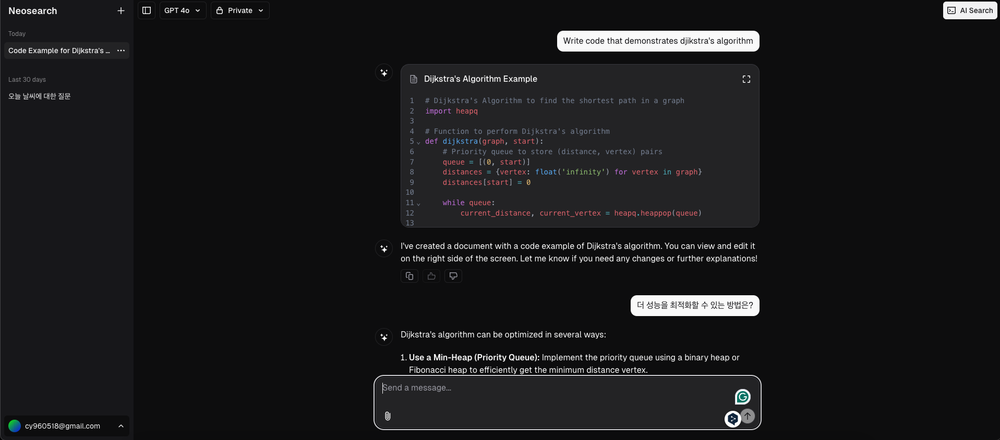
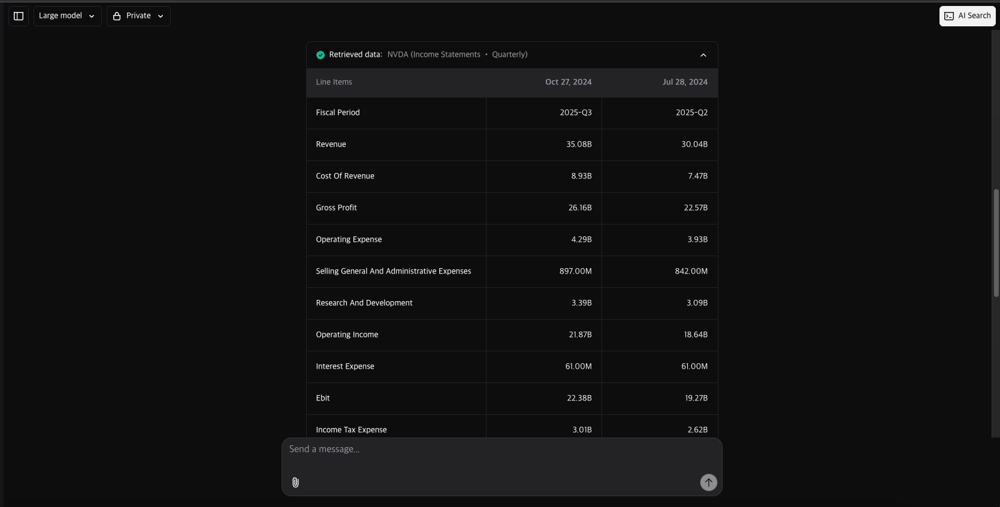
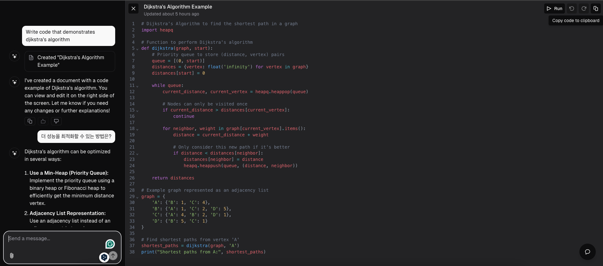
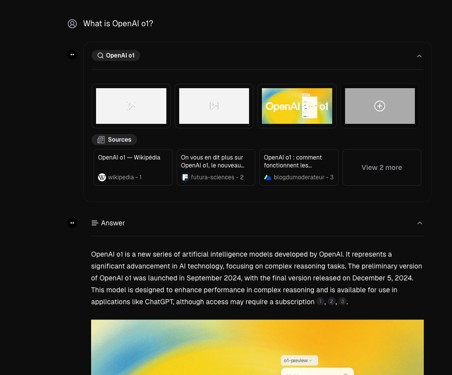
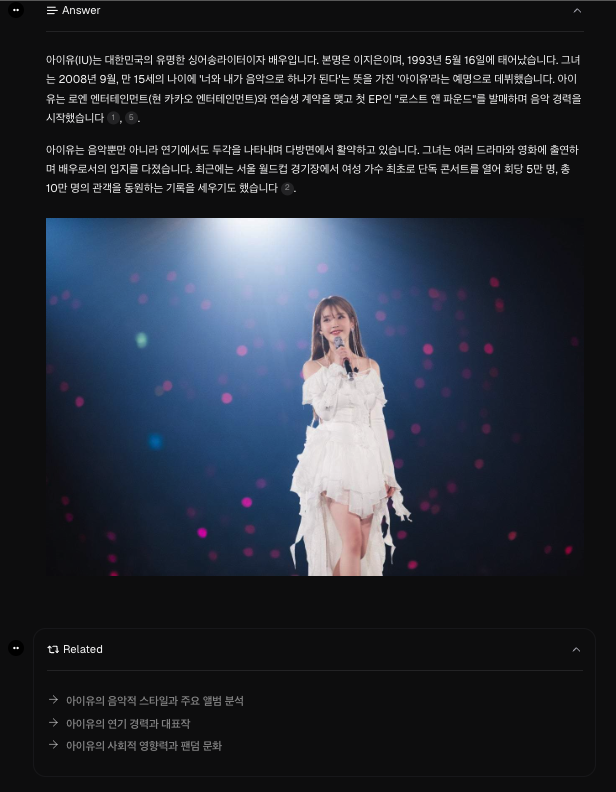

# Neosearch

AI-based search engine done right.

Chatbot will understand your query and provide you suitable results by using various tools (code generation, weather search, etc).

## Features

For people who want investment agents, we provide a `financial search` support.

You could maximize or run the generated code in the code view.

Also, we support aisearch, which uses external search engines to provide you with the best results.

Neosearch supports real-time search with citation.

The LLM chatbot suggests the next question candidates for the user.

## ToDo

- [x] Add support for reasoning model in the chatbot view
- [ ] Add support for Deep Research
    - [x] Implement the basic Deep Research workflow
    - [ ] Define the DB schema for the Deep Research
    - [ ] Make the result of the Deep Research to be downloadable as PDF or something else
    - [x] Implement ray-based Deep Research workflow worker
    - [ ] Add support for async queue based Deep Research workflow
- [x] Compare trafilatura bs4 and newspaper3k
- [x] Add support for [FastEmbed](https://github.com/qdrant/fastembed) to AI service
- [ ] Use faststream based queueing system for long-running workflow
    - [ ] Add support for kafka-based queueing system
    - [ ] Add support for redis-based queueing system
- [x] Implement the dispatcher
    - [x] Implement dispatcher for linkedin
    - [x] Implement dispatcher for GitHub
    - [x] Implement dispatcher for Medium
    - [x] Implement dispatcher for Wikipedia
    - [x] Implement dispatcher for namuwiki
- [ ] Implement the Hybrid Search retriever
    - [ ] Implement the ParadeDB retriever with LlamaIndex
    - [ ] Add support for caching layer for the retriever
- [ ] Add support for [late-chunking](https://github.com/jina-ai/late-chunking) for better IR
- [ ] Add support for [ScrapeGraphAI](https://github.com/ScrapeGraphAI/Scrapegraph-ai)
