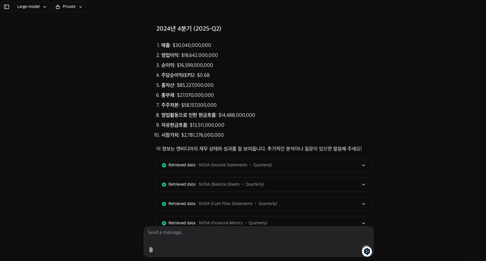

# Neosearch

AI-based search engine done right.

Agent could understand your query and provide you suitable results by using various tools (code generation, weather search, financial database, etc).

For people who want investment agents, we provide a `financial search` support.

## Features

You could maximize or run the generated code in the code view.

Also, we support aisearch, which uses external search engines to provide you with the best results.

Neosearch supports real-time search with citation.

The LLM chatbot suggests the next question candidates for the user.

