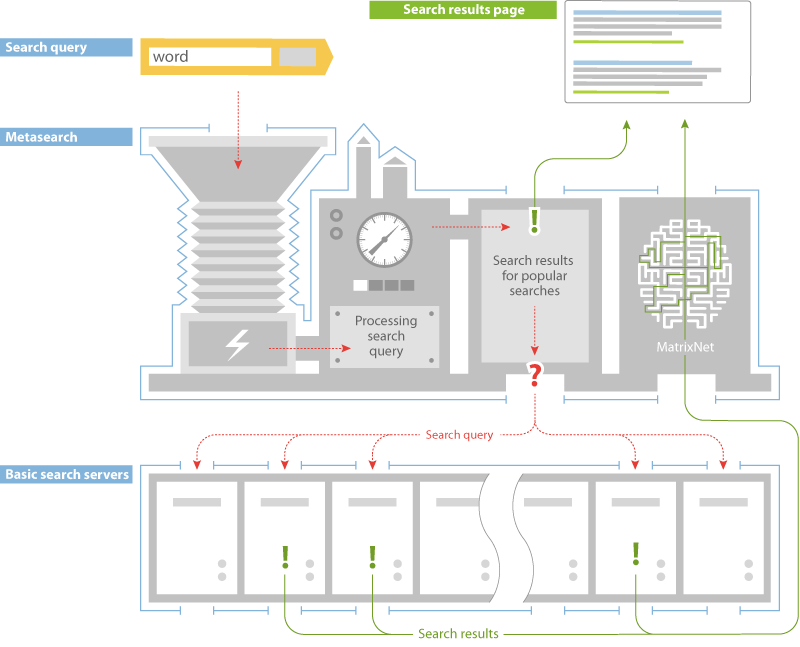

# Yandex Search Architecture

Yandex is a Russian multinational technology company providing Internet-related products and services, including an Internet search engine called Yandex Search.

## Overview

The Yandex search engine sees tens of millions queries every day.
All of these queries need to be satisfied not only with precision, but also very fast.
To find an answer to a specific user query in the enormous amounts of information on the internet, Yandex builds an index, which gives structure to this effort.
The problem is the size of this index, which is meant to help finding an answer to a user’s search query very fast, is still too large.
To solve this problem Yandex performs every search simultaneously on portions of the index distributed among thousands of servers.

**The architecture of a search engine allows to easily add new servers to the existing structure and increase its processing capacities to accommodate the new data continually appearing on the ever-expanding internet.**

## Search Architecture

Each user quiery first goes to 'metasearch'. The metasearch system analyses each search term in real time, looking at a number of qualities, such as its region, type, or grammatical form.
After that, the metasearch checks its cache memory for search results that might have already been delivered for the same search query before.
Instead of looking for search results to one and the same query each time someone makes it again, metasearch saves results for some of the popular searches in its cache and keeps them there for some time for future reference.

If the system's cache cannot offer ready-made answers to a query, metasearch sends this query to the basic search servers.
This is where Yandex keeps its search database – a kind of a carbon copy of the internet.
The search database is divided among all system's servers to facilitate fast search – instead of performing the search on the whole database, it's faster to break it into portions and search all of them at once.
Every server also has backup replicas to distribute the load and secure the data — if a server fails to respond in time, the system can still retrieve search results from backup servers.
At any given moment, metasearch accesses only the least loaded of the thousands of the basic search servers, doing it so that the data on the servers it accesses represents the entire search database.

Each of the basic search servers responds with a list of web documents that contain words matching the terms of the user’s search query.
Metasearch, then, pools these documents, ranks them using [MatrixNet](https://yandex.com/company/technologies/matrixnet?), and delivers them to the user as links on the search results page.

This is what enables Yandex to deliver answers to users’ search queries in a fraction of a second.

## MatrixNet

In 2009 Yandex launched MatrixNet, a new method of machine learning.
A key feature of this method is its resistance to overfitting, which allows the Yandex’ search engine take into account a very large number of factors when it makes the decision about relevancy of search results.
But now, the search system does not need more samples of search results to learn how to tell the ‘good’ from the ‘not so good’.
This safeguards the system from making mistakes by finding dependencies that do not exist.

MatrixNet allows generate a very long and complex ranking formula, which considers a multitude of various factors and their combinations.
Alternative machine learning methods either produce simpler formulas using a smaller number of factors or require a larger learning sample.
MatrixNet builds a formula based on tens of thousands of factors, which significantly increases the relevance of search results.

Another important feature of MatrixNet is that allows customize a ranking formula for a specific class of search queries.
Incidentally, tweaking the ranking algorithm for, say, music searches, will not undermine the quality of ranking for other types of queries.
A ranking algorithm is like complex machinery with dozens of buttons, switches, levers and gauges.
Commonly, any single turn of any single switch in a mechanism will result in global change in the whole machine.
MatrixNet, however, allows to adjust specific parameters for specific classes of queries without causing a major overhaul of the whole system.

## References

- [Yandex Search Architecture](https://yandex.com/company/technologies/searcharch/)
- [Yandex MatrixNet](https://yandex.com/company/technologies/matrixnet?)
