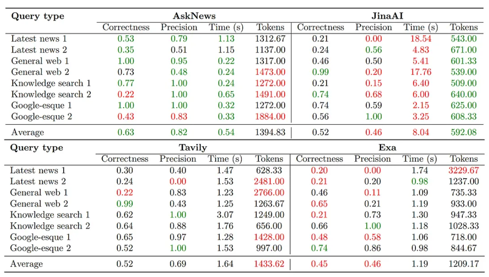

# Helpful Resources

## Search

### Vector Search

- [벡터 검색 알고리즘 살펴보기(1): Similarity Search와 HNSW](https://pangyoalto.com/faiss-1-hnsw/)
- [벡터 검색 알고리즘 살펴보기(2): HNSW, SPANN](https://pangyoalto.com/hnsw-spann/)

### Benchmarking Search services for LLMs

- [Context is King — Evaluating real-time LLM context quality with Ragas](https://emergentmethods.medium.com/context-is-king-evaluating-real-time-llm-context-quality-with-ragas-a8df8e815dc9)
    * AskNews showed the best accuracy and the shortest retrieval time
    * JinaAI retrieval retrieves the least number of tokens, but took the longest time for the search
    * Exa was the worst in terms of accuracy and efficiency (too many tokens, and the worst accuracy)
    * Tavily was the Top-2 in terms of accuracy, but retrieved too many tokens

